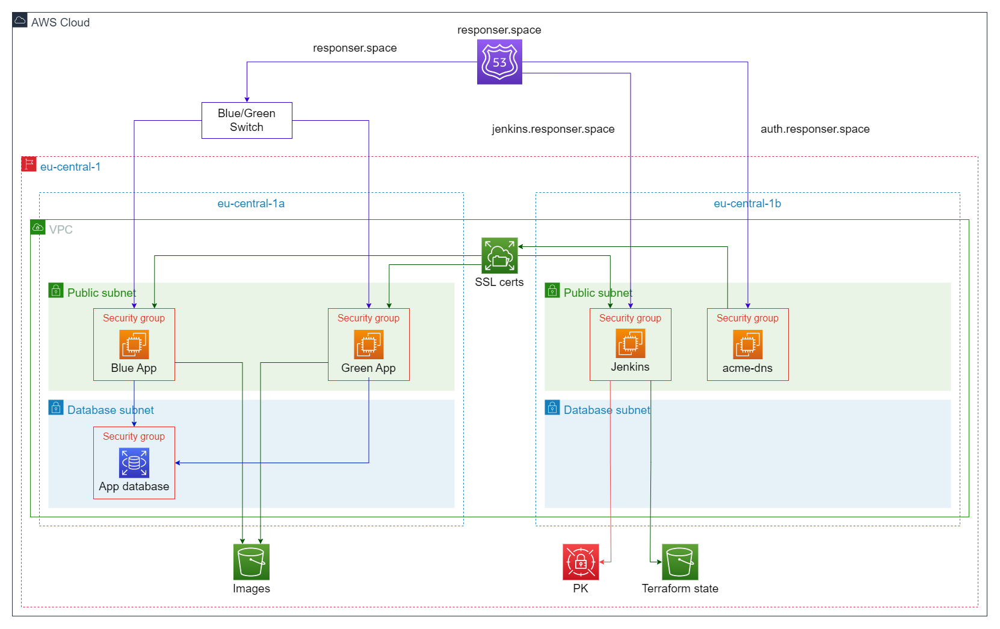

# EPAM [OnlineUA] Cloud&DevOps Fundamentals Autumn 2022 | Final Project

### [responser.space]()

## Overview

---

Responser is a prototype of popular social network written on __Java__ with basic pull
of functionalities. (registration, login, post, comments, etc.)

On the operations side application is running on __AWS Cloud__. Infrastructure
built with __Terraform__ and __Jenkins__ is responsible for __CI/CD__
process.

### Technologies Stack:

#### Development

- __Frontend__
  - Thymeleaf
  - Bootstrap
- __Backend__
  - Java
  - Spring Framework
- __Database__
  - MySQL

#### DevOps

- __AWS__
  - VPC
  - EC2
  - RDS
  - S3
  - EFS
  - Route53 (SSL certificates provided by __Let's Encrypt__)
  - Secrets Manager
- __IaC__
  - Terraform
- __CI/CD__
  - Jenkins
- __Configuration Automation__
  - Ansible
  - Bash
- __Containerization__
  - Docker

## Infrastructure

---



### Terraform

Terraform is responsible for creating several application 
specific modules besides with services that has created
manually. (Jenkins, DNS challenges, Route53 Hosted Zone)

So with given IDs of VPC, Subnets, etc. __Terraform runs 
these modules:__

#### RDS module

Creates __Security Group__, __Database Subnet Group__ from private subnets of existing
__VPC__ and creates MySQL database. 
Output contains values needed for application 
connectivity with database.

#### S3 module

Creates public __S3__ bucket. This bucket will
be used as a storage for image files which application posts
contains.

#### EC2 module

Creates __EC2__ instance and __Security Group__ for application.
Main terraform file use the same EC2 module to create
both Blue and Green instances.
Outputs public IP address of the instance.

#### Additional configuration

After completing infrastructure build resource __hosts.cfg__
fill created instances IP addresses in __hosts.ini__ inventory file
for __Ansible__ playbooks.

``` HCL
resource "local_file" "hosts_cfg" {
  content = templatefile("${path.module}/templates/hosts.tpl",
    {
      blue = [module.blue.public_ip]
      green = [module.green.public_ip]
    }
  )
  filename = "../ansible/hosts.ini"

  depends_on = [module.blue, module.green]
}
```

## Docker inside Jenkins EC2 instance

---

Jenkins runs from Docker image with pre-installed Docker in it
to run Jenkins Agents nodes from DockerHub image. ([Dockerfile](Dockerfile) of the latest version of Jenkins node Docker image)

Also, Jenkins Agents have pre-defined environment variables
such as AWS credentials for __aws cli__ ans __Route53__ Hosted
Zone ID.

``` Groovy
agent {
        node {
            label 'jenkins-docker-agent'
        }
}
```


## CI/CD

---


### Maven

__Maven__ is responsible for Build and Test stages. After
preparing application for next stages of pipeline __Maven__ goes
through the unit and integration tests.

### Terraform

__Terraform__ is running __init__ and __plan__ stage first to 
make sure code is ready for the __apply__ stage and build
infrastructure.

### Deployment Strategy State

This stage is set of bash scripts to pull current state of 
__responser.space__ A record on __Route53__ Hosted Zone.
(It can be weather "blue" or "green")

So __deploy_state.sh__ pull information from AWS using __aws cli__
and write these values into file to export it as environment
variables with __export_state.sh__ in the future stages.

### Ansible PK and Vars retrieval

This stage essential for retrieve Private Key to Jenkins Agent
environment from __AWS Secrets Manager__ for __Ansible__.

Second action that happening in this stage is bash script
which write in __vars.yaml__ file all __terraform outputs__ values that __Ansible__
will use in playbooks.

### Ansible EFS Mount

This playbook is responsible for mounting __EFS__ with SSL
certificates on application virtual machines.

### Ansible Web

Ansible Web is a set of essential configurations like __nginx__
installation as a reverse proxy and redirect from HTTP to HTTPS.
As well as __Java__ installation to run the application.
Basically to sett up environment for the deployment.

### Ansible Deployment

Export environment variables and upload the __.jar__ file with
application and runs it.

### Post-Deployment Traffic Switch

Bash script that changes the __current__ value of tag on __Route53__
Hosted Zone and update the __responser.space__ A record with
the IP address of machine with new version of application.